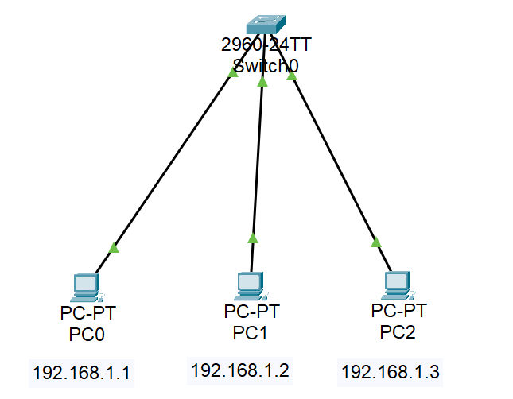
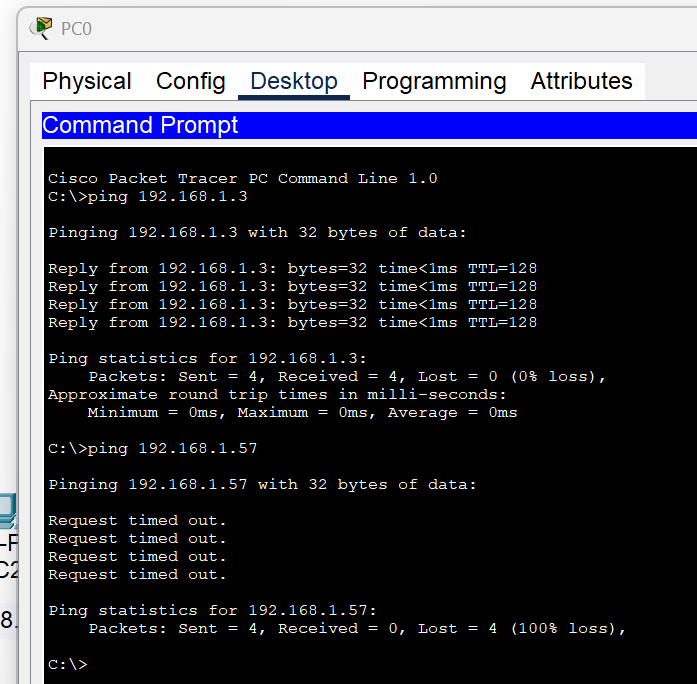
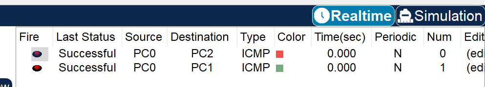

# 🧪 Lab 1: Wired LAN Setup

## 🎯 Objective
Set up a basic wired LAN using a switch and three PCs. Assign static IPs, test connectivity using `ping`, and observe packet flow using Cisco Packet Tracer simulation mode.

## 🛠️ Topology

- **PC0**: 192.168.1.1  
- **PC1**: 192.168.1.2  
- **PC2**: 192.168.1.3  
- **Switch**: 2960-24TT (default config)

All connected via straight-through cables to the switch.

## ⚙️ Steps

1. **Drag Devices**: 1 switch, 3 PCs.
2. **Connect** with straight-through cables:
   - PC0 → Fa0/1  
   - PC1 → Fa0/2  
   - PC2 → Fa0/3  
3. **Assign IPs** under `Desktop > IP Configuration`:
   - PC0 → `192.168.1.1 / 255.255.255.0`  
   - PC1 → `192.168.1.2 / 255.255.255.0`  
   - PC2 → `192.168.1.3 / 255.255.255.0`  
4. **Verify with Ping** from PC0 to PC1 and PC2

## ✅ Ping Output

- Successful ping from PC0 → PC2 ✅  
- Invalid ping to unreachable IP `192.168.1.57` fails as expected ❌

## 🔄 Simulation Mode

- ICMP packets successfully transmitted from PC0 to PC1 and PC2  
- Simulation confirms correct packet forwarding through the switch

## 📌 Conclusion

LAN setup is working as expected. All three PCs are in the same subnet, wired through a switch, and successfully communicating.  
Simulation view verifies ICMP traffic path — clean setup with no errors.

> 💡 Next Up: Lab 2 - Router Setup 🔜
