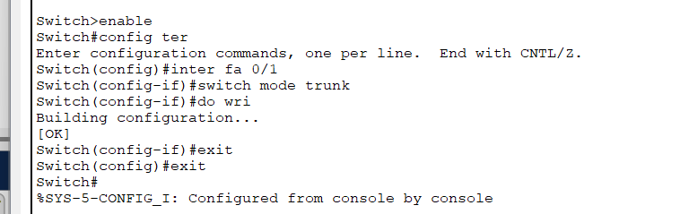
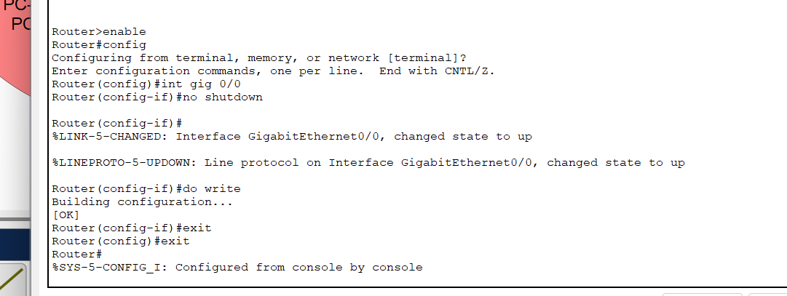
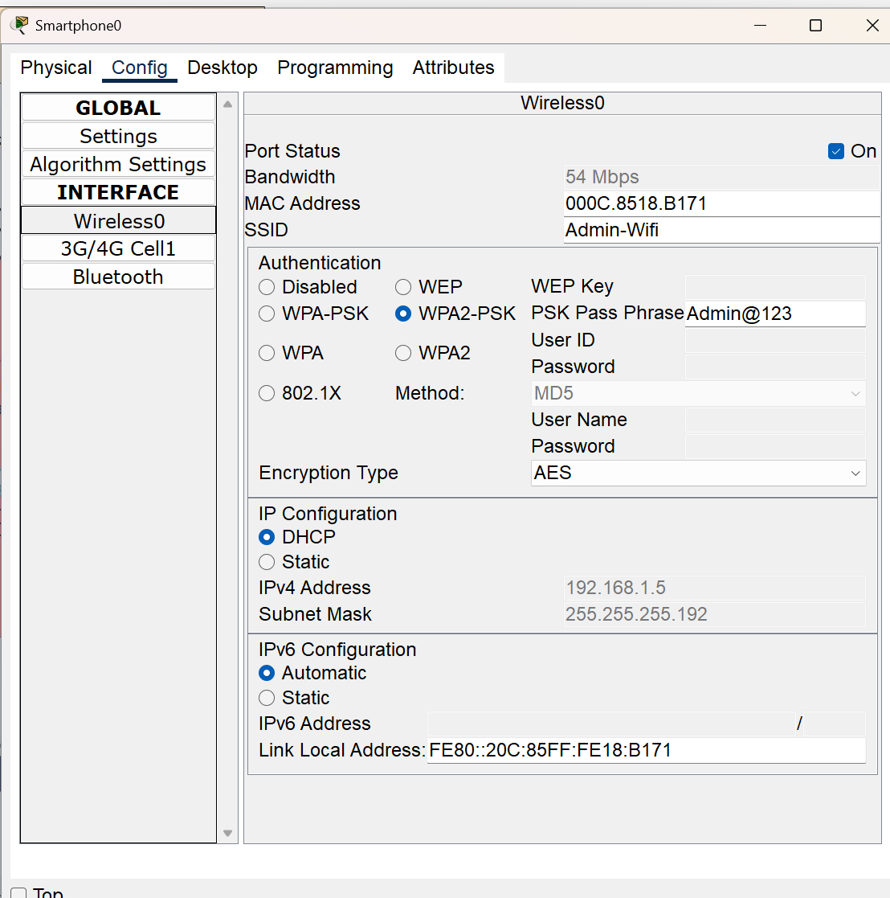

# XYZ Company Branch Network - Cisco Packet Tracer

## 📋 Problem Statement

XYZ company is a fast-growing company in Eastern Australia with more than 2 million customers globally. The company deals with selling and buying of food items, which are basically operated from the headquarters. The company is intending to open a branch near the local village Bonalbo. Thus, the company requires young IT graduates to design the network for the branch. The network is intended to operate separately from the HQ network. Being a small network, the company has the following requirements during implementation:

1. One router and one switch to be used (all CISCO products).
2. 3 departments (Admin/IT, Finance/HR and Customer service/Reception).
3. Each department is required to be in different VLANS.
4. Each department is required to have wireless network for the users.
5. Host devices in the network are required to obtain IPv4 address automatically.
6. Devices in all the departments are required to communicate with each other.

Assume the ISP gave out a base network of 192.168.1.0, you as the young network engineer who has been hired, design and implement a network considering the above requirements.

## 🎯 Objective

To design and simulate a VLAN-based, wireless-enabled branch office network using Cisco Packet Tracer with automatic IP configuration and inter-VLAN communication.

## 🧠 Network Details

| Parameter        | Value                    |
|------------------|---------------------------|
| Base Network     | `192.168.1.0/24`          |
| Subnet Mask      | `255.255.255.192` (/26)   |
| Subnets Needed   | 3                         |
| Block Size       | 64 IPs per subnet         |

### Subnet Breakdown

#### Subnet 1 - Admin/IT Department
- Network ID: `192.168.1.0`
- Host Range: `192.168.1.1` – `192.168.1.62`
- Broadcast Address: `192.168.1.63`

#### Subnet 2 - Finance/HR Department
- Network ID: `192.168.1.64`
- Host Range: `192.168.1.65` – `192.168.1.126`
- Broadcast Address: `192.168.1.127`

#### Subnet 3 - Customer Service/Reception
- Network ID: `192.168.1.128`
- Host Range: `192.168.1.129` – `192.168.1.190`
- Broadcast Address: `192.168.1.191`

## 🖥️ Network Design

### Initial Topology with VLANs and Access Points

### Updated Design with Smartphones (Wireless Demo)

## 🔧 Configuration Snapshots

### Switch VLAN Assignment

### VLAN Table Verification

### Access Point Configurations

- **AP0 Config**  
  

- **AP1 Config**  
  

### Trunk Port Configuration on Switch

### Router Gigabit Interface Activation

### DHCP Pool Configuration for All VLANs

### DHCP Result on Wired PC

### Subinterface VLAN Setup on Router

## 📶 Wireless Testing

### Smartphone WiFi DHCP Setup

### Laptop WiFi DHCP Setup

### Ping Test Between Devices

### Wireless Scan for Available Networks

### WPA2 Authentication Prompt

## ✅ Conclusion

This Cisco Packet Tracer project showcases a complete VLAN-segmented and wireless-enabled office branch network using:

- Subnetting and DHCP services
- Inter-VLAN communication using subinterfaces
- Wireless security with WPA2
- Full connectivity verified via ICMP (ping) simulation

## 🔗 References

- [Cisco Subnetting Guide](https://www.cisco.com/c/en/us/support/docs/ip/routing-information-protocol-rip/13788-3.html)  
- [Cisco Packet Tracer Labs](https://www.netacad.com/)  
- 🎥 [YouTube Reference – Network Design](https://youtu.be/F_dSpaTMyuA?si=50NbsjWy9SBweKR6)